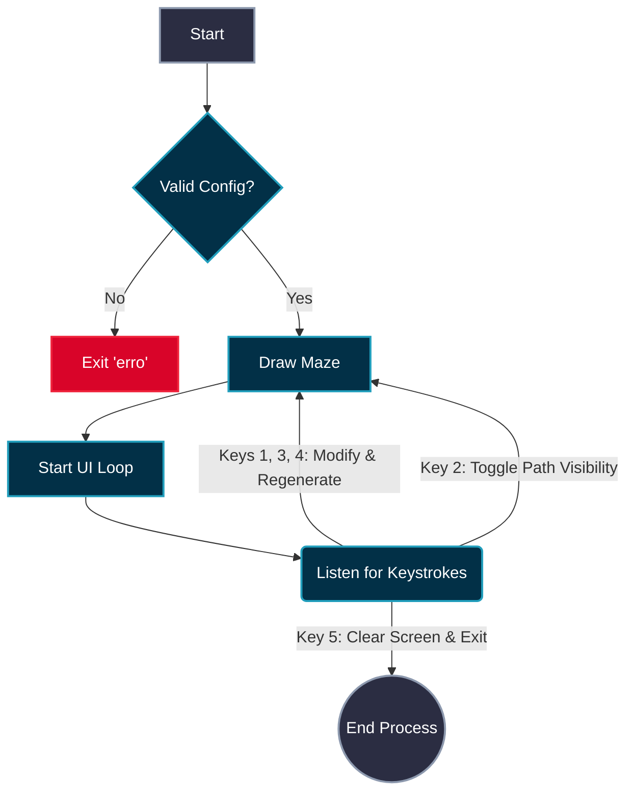

_“A labyrinth is not a place to be lost, but a path to be found.”_

### *Objective*

  This project propose is to create an labyrinth using an algorithm that grabs an grid (matrix of numbers 2D matrix (a List of Lists)) and using randomness it goes throw it and changes the each number it finds.
  Each number is the representation in hexadecimal of paths (to walk trough) and walls, each wall and is direction (or where it is) is represent by bits (numbers that can be 1,2,4,8) and the way to remove each wall is to actually remove the value from the original value, that is 15 (0-15) or F (0-9 & A-F).
  That number represents an close path, with all "walls intact".

+ *Grid (5X5) Representation __before__ the creation in hexadecimal.*
			`FFFFF`
			`FFFFF`
			`FFFFF`
		   `FFFFF`
		   `FFFFF`
+ *Grid (5X5) Representation __after__ the creation in hexadecimal.*			
			`95157`
			`AD057`
			`AD017`
			`ABAC3`
			`EC47E`
The grid and the maze needs to be generated reading an text file `config.txt` that holds the maze configurations (entry, exit, width and height...)

### *Rules*

The rules of this project are mostly applied to the actually creation off the graphic part of the maze, on how to show it to the user, so that only possible to show the labyrinth and such in only two possible ways:
	1: Using [[How ANSI codes are used in the project|ASCII ART & ANSI CODES]] on the terminal (chosen for this project)
	2: Using 'MiniLBX', (a graphic library adapted from C language to python)

The complete visual implementation is detailed in the [[Terminal an UI & UX experience]] architecture."

For the code, it needs to be written on python (version >= 3.10) and needs to follow [mypy](https://mypy-lang.org/) and [flake8](https://flake8.pycqa.org/en/latest/) stander rules for typing and clean code and also Include doc-strings in functions and classes following [PEP 257](https://peps.python.org/pep-0257/) (e.g., Google or
NumPy style) to document purpose, parameters, and returns.

### User flowchart

